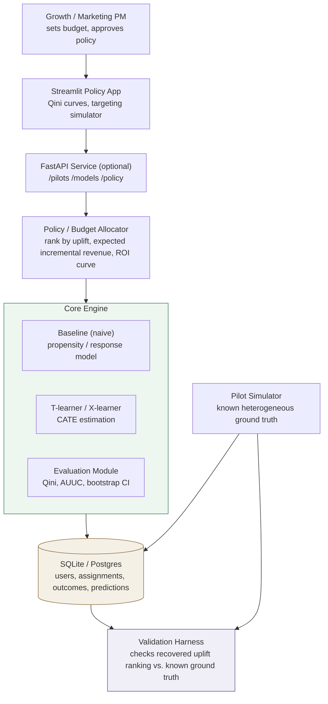

# Causal Uplift Targeting

Uplift modeling system for budget-constrained incentive targeting.

## The problem

Standard practice targets incentives (discounts, cashback, fee waivers) at customers with
the highest predicted probability of converting. This is the wrong quantity: it targets
"sure things" who would have converted anyway, and misses "persuadables" who convert
*only because* of the incentive. The right quantity is the conditional average treatment
effect (CATE) — the incremental probability of conversion the incentive itself causes —
not the raw conversion probability.

This project builds that estimation pipeline end to end, on simulated pilot data with
known ground-truth heterogeneity, so every claim it makes is checkable rather than
asserted.

## Status

🚧 **Under active development.** This README will be replaced with full results
(validation numbers, Qini comparisons, screenshots, FAQ) once the pipeline is built and
validated. Currently in early scaffolding — see the roadmap below.

## Planned architecture

- **Data layer**: configurable pilot simulator with known per-segment treatment effects
  (persuadables, sure-things, lost-causes), relational storage (SQLite/Postgres-portable)
- **Core engine**: naive propensity baseline (kept permanently as a documented wrong-answer
  contrast), T-learner and X-learner meta-learners hand-implemented on scikit-learn base
  learners
- **Evaluation**: Qini curve / Qini coefficient / AUUC, cross-checked against `causalml`,
  with bootstrap confidence intervals
- **Policy layer**: budget-constrained targeting with expected incremental revenue and a
  marginal-ROI (diminishing returns) curve
- **Validation harness**: proves — not asserts — that naive targeting fails to beat random,
  and that uplift modeling beats both, against known simulator ground truth
- **Apps**: Streamlit interactive policy simulator; optional FastAPI service layer

## Architecture

The policy layer is deliberately separated from the core engine: it consumes model
output (predicted uplift per user) but contains no modeling logic itself, so the budget
objective can be swapped (e.g., maximize revenue vs. maximize conversions vs. a
minimum-ROI floor) without touching any causal estimation code. The validation harness
sits outside the request path entirely — it's a standing proof against the simulator's
known ground truth, not something invoked per user request.

## Roadmap

| Phase | Scope |
|---|---|
| 0 | Environment, repo scaffold, config validation |
| 1 | Pilot simulator with heterogeneous ground truth |
| 1.5 | Train/test split module |
| 2 | Baseline propensity model + naive-vs-random failure proof |
| 3 | T-learner |
| 4 | X-learner |
| 5 | Evaluation module (Qini/AUUC/bootstrap CI) |
| 6 | Ground-truth validation harness |
| 7 | Policy / budget allocation module |
| 8 | API layer (optional) |
| 9 | Streamlit app + portfolio writeup |
| 10 | End-to-end integration tests |

## Why this exists

This is a portfolio project demonstrating causal-inference-based targeting as distinct
from standard propensity/response modeling — the gap between "who will convert" and
"who converts *because of* the intervention," and why that gap has real budget
consequences.

## License

TBD.